# Conferencia Virtual de QGIS en America del Norte: Taller Intro
http://qgis.us/qgis-na-2020  

La Conferencia Virtual de QGIS en America del Norte es un evento en línea que está programado para las siguientes fechas, todos los días viernes: 17 de julio, 24 de julio, y 31 de julio. Cada día comienza con un taller de 2 a 4 horas, dichos talleres se llevaran a cabo en la plataforma Zoom, y la otra mitad del día habrá presentaciones hechas via streaming de YouTube. Las sesiones se presentarán en ingles, pero el primer día habrá un taller en español. Los siguientes talleres que se ofrecen son los siguientes:  
17 de julio: Introducción de QGIS (opciones en íngles y español) 
24 de julio: Visualización 2D de geología con QGIS 
31 de julio: Recolección de datos con "Input" y QGIS  

El registro es gratuito, pero es un requisito para recibir la liga de Zoom.  

* * *
## Workshop Details
NEW YORK, United States | MEXICO CITY, Mexico | SANTIAGO DE CHILE, Chile | MADRID, Spain
--- | --- | --- | --- 
10:00a Fri, Jul 17 2020 to 2:00p Fri, Jul 17 2020 | 9:00a Fri, Jul 17 2020 to 1:00p Fri, Jul 17 2020 | 10:00a Fri, Jul 17 2020 to 2:00p Fri, Jul 17 2020 | 4:00p Fri, Jul 17 2020 to 8:00p Fri, Jul 17 2020

Este taller cubrirá los conceptos básicos de los sistemas de información geográfica, los cuales incluyen los cinco componentes principales: el hardware, el software, los datos, los procesos y metodologias, y las personas involucradas. Habrá una presentación de un resumen del hardware y los software más comunes. La sesión utilizará datos públicos como fuentes de información y explicará los procesos comunes para la recolección de datos, incluyendo recolección móvil de datos y hojas de trabajo de campo. Habrá modulos para poner los conceptos en practica y crecer sus capacidades en los siguientes temas: 

- Visualización de datos 
- Propiedades de la capa 
- Herramientas básicas 
- Tablas de atributos 
- Selecciones espaciales y no espaciales 
- Herramientas de geoprocesos y la caja de herramientas de procesamiento 
- Plugins 
- Diseño geográfico y vista de impresión

La sesión terminará con un diálogo sobre la movilización de sus redes individuales e institucionales para crecer un programa eficiente y productivo de sistemas de información geográfica, utilizando ejemplos de Mexico, Ucrania, y Nueva York.

## Objectives
- Review the QGIS software and methods for adding spatial data.
-	Evaluate various image enhancement techniques for both vector and raster data. 
-	Edit existing vector datasets.
-	Review the components of metadata and databases.
-	Use basic tools and panels in QGIS.
-	Manipulate an attribute table in QGIS, including table joins.
-	Phrase an expression to select attribute features.
-	Select features based on their relative relationship to other features (e.g. location).
-	Use common geoprocessing tools.
-	Download new plugins. 
-	Learn basic principles of cartographic design.
-	Use the print layout in QGIS to create a final map product.

## Data
Download data [here](https://drive.google.com/drive/folders/17AXbAxIPZgEM1wNTVL_Mxe051HGYUzSi?usp=sharing).
Layer | Location | Year | Source
--- | --- | --- | ---
**Civil Boundaries**| New York State | 2019 | NYS Office of Information Technology Services GIS Program Office (GPO)
**Roadway Inventory System**| Tompkins County | 2018 | New York State Department of Transportation (DOT)
**Waterbody Inventory**| New York State | 2017 | NYS Department of Environmental Conservation, Division of Water, Bureau of Water Assessment and Management
**Land Use Land Cover**| Tompkins County | 2012 | [Tompkins County Planning Department](https://cugir.library.cornell.edu/catalog/cugir-008162)
**Digital Elevation Model**| Ithaca, Tompkins County | 1995 | [U.S. Geological Survey](https://cugir.library.cornell.edu/catalog/cugir-008186)
**Orthoimagery**| Ithaca, Tompkins County | 2018 | NYS Digital Ortho-imagery Program (NYSDOP), NYS Office of Information Technology Services, GIS Program Office

## Workshop Preparation
- Favor de rellenar este cuestionario antes del fin del día miercoles, 15 de julio: [Questionario para participantes del taller introductorio de QGIS](https://forms.gle/gc8jzvZejLUwRvZJ9);
- Leer las reglas de la reunión en la siguiente sección;
- Familiarizarse con [los términos de sistemas de información geográfica](https://gisgeography.com/gis-dictionary-definition-glossary/#B)--se puede traducir la página con Google Translate en Google Chrome
- Descargar [QGIS 3.10](https://qgis.org/en/site/forusers/download.html); y
- Descargar [los datos del taller en Google Drive](https://drive.google.com/drive/folders/17AXbAxIPZgEM1wNTVL_Mxe051HGYUzSi?usp=sharing).

## Workshop Expectations
1. Al comienzo de la reunión, asegúrese de que su micrófono esté silenciado. El único momento para activar el micrófono en la reunión principal es si usted ha levantado la mano y uno de las instructores ha dicho que lo activará para hablar. En los cuartos de asesoría simultánea, puede activar el sonido de sus micrófonos y hablar con sus compañeros de equipo, pero trate de mantenerse concentrado y enfocado en la tarea.
1. Puede tener su video activado o desactivado.
1. No interrumpa durante la presentación o las demostraciones de QGIS. Si tiene una pregunta, use el icono de levantar la mano en el chat o haga su pregunta directamente en el chat. Alguien estará monitoreando el chat para responder preguntas a medida que surjan. Las preguntas y comentarios también se pueden compartir en el cuarto de asesoría simultánea.
1. La instructora preguntará si los participantes están listos para pasar al siguiente tema o actividad. Los participantes harán clic en el icono "sí" o "no" en el chat de Zoom para informar al instructor si están listos o no. Si la mayoría de los participantes están listos, entonces el taller continuará. Si la mayoría de los participantes no están listos, la instructora revisará el chat para ver qué debería revisar antes de seguir adelante.
1. Solo las instructores pueden compartir su pantalla en la reunión principal. Es posible que usted pueda compartir su pantalla en el cuarto de asesoría simultánea cuando sea apropiado.

## Introduction: Coordinate reference systems
Prior to opening any geographic information system (GIS), one should be familiar with coordinate reference systems as you will encounter several different systems in your career as a GIS user. Fundamentally, coordinate reference systems, or spatial reference systems, use coordinates to locate geographical entities, which are mapped using a unique map projection. Map projections differ by type (i.e. pseudocylindrical/cylindrical, pseudoconical/conic, and azimuthal, among others) and whether or not the projection distorts areas or shapes (i.e. equidistant, conformal, and equal-area, among others). All beginner QGIS users should know that EPSG codes are used to identify the coordinate reference system. EPSG stands for the European Petroleum Survey Group – who created the registry of coordinate reference systems codes, which are described at [epsg.io Coordinate Systems Worldwide](https://epsg.io/). 

Different organizations, institutions, and individuals may identify a standard coordinate reference system for homogeneity throughout mapping initiatives and projects. For this training, we will be using the World Geodetic System WGS84 ellipsoid and the Universal Transverse Mercator (UTM) coordinate system. Most of New York State is in the 18th zone of the northern hemisphere, which would be EPSG: 32618.

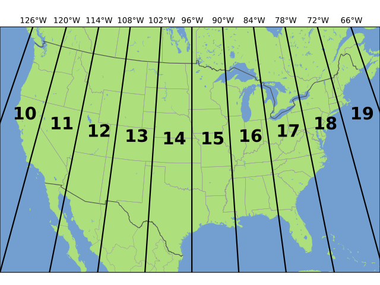

*Figure 1. Contiguous US UTM Zones, projected with Lambert conformal conic
Source: [Chrismurf at English Wikipedia](https://commons.wikimedia.org/wiki/File:Utm-zones-USA.svg)*

Coordinates show us precisely where we are in the world. Coordinates are created based on a known origin. A geographic coordinate system typically uses latitude and longitude that breaks the world up into axes. You can imagine (0, 0) being the core of the earth, and the latitude and longitude are the angles from the Equator and the/a prime meridian; hence, geographic coordinates are in degrees (°), minutes ('), and seconds ("), DMS, where 60 seconds equals a minute and 60 minutes equals a degree. In Figure 1, 45° north and 45° west lies somewhere in the North Atlantic if the origin is 0° latitude (the Equator) and 0° longitude (Greenwich, England). DMS of meridians (longitude) are shortened as you move closer to the poles, whereas they are “widest” at the Equator. Parallels (latitude), on the other hand, are relatively closer to being equidistant from the Equator to the poles; however, we have to consider that our Earth is not a perfect sphere, rather an oblate spheroid (or ellipsoid) due to Earth’s rotation about its shorter X axis.

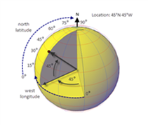

*Figure 2. Contiguous US UTM Zones, projected with Lambert conformal conic
Source: [Geographic Coordinate System](http://help.autodesk.com/view/ACD/2016/ENU/?guid=GUID-14B82899-9C2D-4A34-8A02-49319C6FB38C)*

There is a second type of coordinate system called the projected coordinate system, which attempts to correct for this change in angles by projecting the coordinates from a specific geographic coordinate system onto a 2-dimensional plane that uses linear units. Therefore, projected coordinates are in meters- or feet-distance from the point of origin of the plane. For instance, in the Universal Transverse Mercator projected coordinate system each zone has an origin, central meridian, and false origin. False origins for northern zones lie on the Equator and 500,000 meters west of the central meridian.

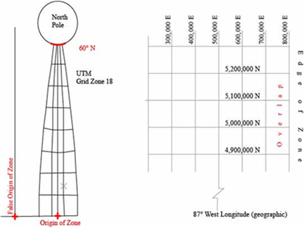

*Figure 3. Contiguous US UTM Zones, projected with Lambert conformal conic
Source: [Projected coordinate system, modified by author](http://help.autodesk.com/view/ACD/2016/ENU/?guid=GUID-14B82899-9C2D-4A34-8A02-49319C6FB38C)*

# Introduction to QGIS
QGIS is a free and open source software used to visualize, create, edit, analyze, and publish geospatial data that runs on Windows, Mac, Linux, and BSD. It helps us answer geographic questions and to create persuasive maps.

-	Official QGIS site: http://qgis.org/
-	QGIS Map Showcase: https://www.flickr.com/groups/qgis/pool/

First, let us review some things that are included with a QGIS download: 
-	GRASS GIS – (Geographic Resources Analysis Support System) is free; it is used for geospatial data management and analysis, image processing, production of maps and graphics, spatial modeling, and other visualizations. It can be used as a stand-alone program or directly in QGIS  by opening “QGIS Desktop 3.10.x with GRASS 7.8.x”
-	QGIS – (previously, Quantum Geographic Information System) is free; it is used to create, edit, visualize, analyze, and publish geospatial information. Desktop – Start new projects, edit data, perform geospatial analyses. Again, you can open Desktop with GRASS for more analysis options.
-	Qt Designer – to create QGIS plugins’ interface dialogs, but also to create highly customized feature forms for editing vector layers’ attributes in QGIS projects.
-	SAGA GIS (2.3.x) – (System for Automated Geoscientific Analyses) is a GIS software with immense capabilities for geodata processing and analysis. SAGA is programmed in the object oriented C++ language and supports the implementation of new functions with a very effective Application Programming Interface (API).
-	Setup – a windows installer for Open Source GIS project that tracks different open source software and notifies you of newer versions so you can simply upgrade programs.

### Exercise 1. Getting started with QGIS
Step | Example
--- | ---
Start QGIS: Open the Start menu and Type or search for "QGIS 3.10" (QGIS 3.10.7-A Coruña). | 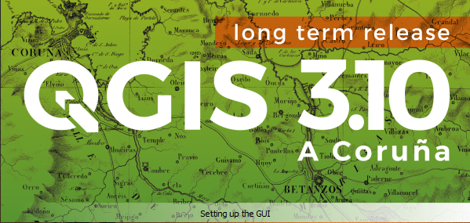
Main bar with drop-down menus | Where you can open files, save the project, access vector processing tools, raster processing tools, settings, configuration and many other things!
Layers panel | This panel is where all the geospatial data that you have added to the project appears. You can activate or deactivate layers by clicking the square to the left of the layer. An X will appear or disappear.
Browser panel | This panel allows for navigating to the folders where your data is stored.
This is where your data is visualized.
Main tools/functions | These are the tools that you have activated for ease-of-access. By right clicking in any of the grey space you can activate or deactivate functions and tools, which add or removes them from this grey space.

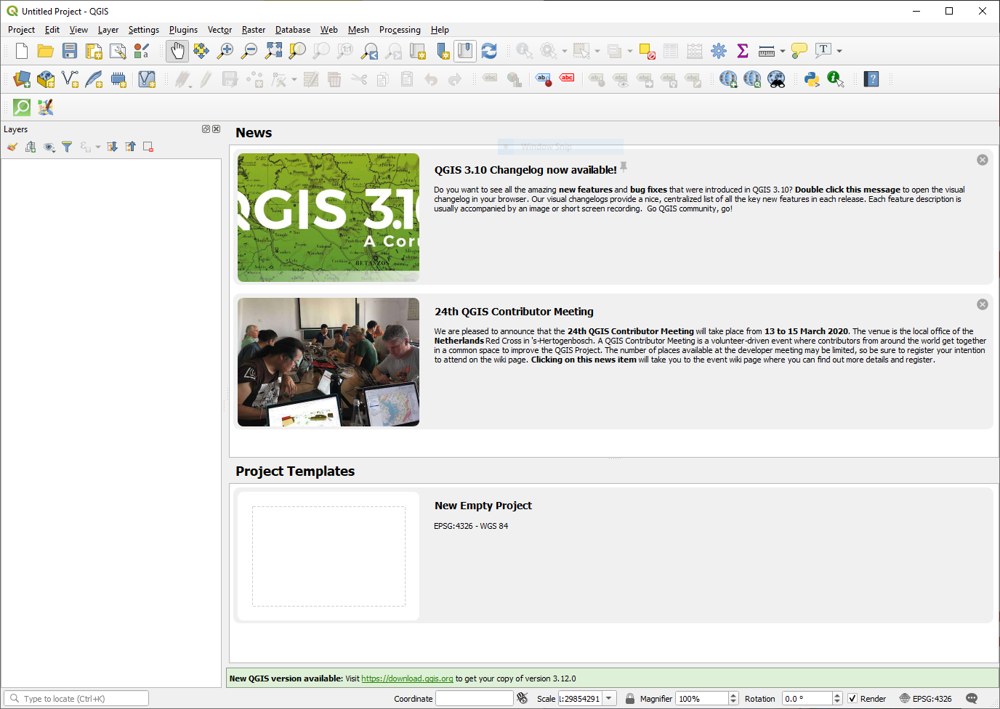
*Figure 4. QGIS Startup Interaface*

Step | Example
--- | ---
In QGIS, set the project coordinate reference system to WGS 84 / UTM Zone 18N, which has the code 32618. This interface can be found on the bottom bar under the map space. It will say EPSG, which represents its spatial reference system identifier. | 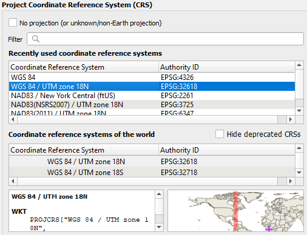
Start a new empty project by clicking on the blank map space/New Empty Project widget. | 
Save the project, immediately, so as to avoid losing any progress on your mapping project. |  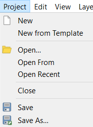
You can adjust the QGIS interface to match your preferences. You can hide or show bars/panels and arrange them anywhere. Right click on the gray part to open the list of toolbars and panels. You can check and uncheck different panels or toolbars to see what they look like in the interface. Note that your panels and toolbars options may differ from those shown in this manual. Before moving on, make sure that the “Browser Panel” and “Layers Panel” are checked and active. | 

*What is spatial data*
Spatial data, also known as geospatial data, is information about a physical object that can be represented by numerical values in a coordinate system.

*What is research data management or a data management plan?*
Research data management (RDM) or data management plans (DMPs) are processes that describe how data will be collected, described, documented, shared, and preserved as part of a project.

*File-naming conventions*
- Letters, numbers and underscores are best
	Date_Location_ProjCode
		2020_Ithaca_Env01
	Location_Project_Date
		Ithaca_Env01_2020
	ProjectCode_Date:
		Env01_2020

*Spreadsheets*
- The best spreadsheet is simplified so that only necessary attributes and values are shown (this way, it is easier to use in a software analysis).
- Whether it is a new spreadsheet or new spatial data with an attribute table, which is basically a spreadsheet, you need to create metadata or a data dictionary for reference.

*Organizing attributes*
- A row is a unique data record, and a column is a category or attribute for all records. Attribute headers tend to be descriptive of the data attribute. For instance, an “Area” header will tell you that the number values represent area. Note that in order to know what unit that data attribute is in, you would need metadata; a data dictionary would be helpful, as well.

*Data dictionary*
- A data dictionary should provide context in which anyone could interpret the variables in your dataset. This may be the easiest supporting document to create, considering that all you really need is Microsoft Word or Notepad. In this separate file, you name the variables and their meaning, format, precision, units, null values, and any other pertinent information needed for interpreting the data.

*Quality assurance and project management*
- There is no one way to do this; it depends on the organization's standards. It is in every step of a project or process. Consider how you will add a quality component to project initiation, planning and organizing, execution and control, and monitoring and evaluation.

*Databases and queries*
- Databases can be used as a way to organize, store, manage, and retrieve information. A database is searchable through a query, meaning that a specific term or number can be searched to find specific information quickly within the database. Many databases use Structured Query Language (SQL) standard query format, which is a standard language for relational database management systems.

# Data Visualization: Vector and Raster Data Models
**Vector data** is often created using a global positioning system (GPS), by interpreting imagery, or running analysis on existing vector data. The data can be represented as a point, line or a polygon. 

- A point represents a fixed coordinate such as an individual building, an individual tree location, or a centroid of an individual place.
- A line is a series of points that are connected, but open at two ends. It could represent a road, river, hiking/biking path, division between one region and another, etc.
- A polygon is also a series of points that are connected but are closed to create a shape. It could be an administrative unit, like an oblast, or parcel data, or an aggregated area or region.

Vector data is often stored as a shapefile (.SHP). However, as you can see in the following list, there are many other file types that QGIS can visualize, such as the KML (keyhole markup language) which is commonly used in Google Earth/Pro. Other accepted formats include:

- Atlas BNA
- AutoCAD DXF
- Comma Separated Value (CSV)
- ESRI Shapefile
- GPS eXchange Format (GPX)
- GeoJSON
- GeoPackage
- GeoRSS
- Geoconcept
- Geography Markup Language (GML)
- INTERLIS 2
- Keyhole Markup Language (KML)
- MS Office Open XML spreadsheet
- Mapinfo MIF
- Mapinfo TAB
- Microstation DGN
- Open Document Spreadsheet
- S-57 Base file
- SQLite
- SpatialLite

**Raster data** appears as an image composed of cells. The data is stored as cells in rows and columns with a unique value representing a geographic phenomenon. The larger the cells the lower the resolution of the raster image.

The most common raster data format is GeoTIFF. However, there are other formats that accepted in QGIS:

- GeoTIFF
- GeoPackage
- ARC Digitized Raster Graphics
- CTable2 Datum Grid Shift
- ELAS
- ENVI .hdr Labelled
- ERMapper .oerf Labelled
- ESRI .hrd Labelled
- Erdas .LAN/.GIS
- Erdas Imagine Images (.img)
- Geospatial PDF
- Golden Software 7 Binary Grid (.grd)
- Golden Software Binary Grid (.grd)
- HDF4 Dataset
- IBM DB2 Spatial Database
- ILWIS Raster Map
- ISCE raster
- Idrisi Raster A.1
- Image Data and Analysis
- Intergraph Raster
- KOLOR Raw
- Leveller heightfield
- MBTiles
- MS Windows Device Independent Bitmap
- Meta Raster Format
- And many more!

## Vector data models
In this next exercise, we will look at the points, lines, and polygons of the New York State region.

### Exercise 2. Vector data models.
Step | Example
--- | ---
**Village**. We will add vector data to the interface to see what land use data looks like as a point shapefile. Locate “NYS_Villages.shp” in your data folder in the browser panel. Drag it into the map space to add to the layers panel. | 
**Roads**. We will add vector data to the interface to see what land use data looks like as lines. View the manage layers toolbar (seen to the right) and click on the “Add Vector Layer” tool or “ctrl + shift + v”. Locate “NYS_Roadways_2018.shp” in your data folder. | 
**Lakes**. We will add vector data to the interface to see what land use data looks like as polygons. Locate “NYS_Lakes_2017.shp” in your data folder. Drag it into the map space to add to the layers panel. |  
**Counties, Towns/Cities, NYS Shoreline**. We will add two other vector data to the interface to see what land use data looks like as polygons. Using your preferred method, add “NYS_Counties.shp”, “NYS_Cities_Towns.shp”, and “NYS_Shoreline.shp” to the layers panel.
In the layers panel, locate the new datasets. You can group the datasets into a toggleable category using the "Add Group" tool. Once you create the group, highlight the layers you want to include in the group and drag and drop them into the group.
 | 
Create a new group for land use and land cover. In that group, add the land use, land cover shapefile for Tompkins County (do not add the raster file, yet). | 

You can toggle the layers on and off to see the difference in geometry (i.e. points, lines, and polygons). The layers are organized like a stack of paper. What is on top is visual priority and “covers” the layers below. So, it is usually best to place point data on top, followed by line data, and lastly polygon data. Drag and drop to move layers up and down.

## Raster data models
Let’s compare these vector models to raster data. As mentioned previously, raster data is stored in a series of columns and rows that create a grid of cells; each cell with a unique value that represents some spatial phenomenon. Raster images are important data sources and serve for many types of analyses in the areas of environmental science, natural resource management, and land development. They provide us with both current and historical information. Since the inherent structure of images is the same as raster models in GIS, the integration of these two technologies is quite common. Look at these two articles that show how satellite images can be used to map natural disasters: See Inside Typhoon Mangkhut in 3-D and Indonesia Earthquake and Tsunami: Before and After Photos of the Destruction. Common datasets that appear in raster format are land use/land cover, digital elevation models, and satellite imagery. We will focus on land use/land cover data, digital elevation models, and orthoimagery for these exercises.

--- | ---
Access to high-resolution imagery is provided by the NYSDOP’s orthoimagery (the program's goal is to obtain imagery for the entire State on a [4 to 5 year cycle](http://gis.ny.gov/gateway/orthoprogram/lotyrs.html)) or orthomosaics provided by drone coverage. This digital Orthoimagery can serve a variety of purposes, from general planning to field reference for spatial analysis to a tool for revision of vector maps. It can also serve as a reference layer (i.e., basemap) for GIS. It is also important to think critically about the date of a satellite image. The interpretation of a January image can differ greatly from a July image considering that January is wintertime and most vegetation and agriculture are in a state of rest in New York State. For example, images from the summer months can show net primary production, crop yields, and vegetation growth better than images from winter months. | 
The Digital Natural Color aerial imagery was acquired in May 2018 using a Microsoft Ultracam Eagle sensor flown at a nominal height of approximately 15,550 feet Above Mean Terrain. The Ground Control used to support the 4-band ortho-imagery production was collected by identifying and surveying photo identifiable points (PID), using existing PIDs, and existing aerial targets. The Digital Aerial Triangulation (DAT) was performed. Digital Surface Models (DSM) used for ortho imagery production were generated and updated as needed using UltraMap mapping software. | 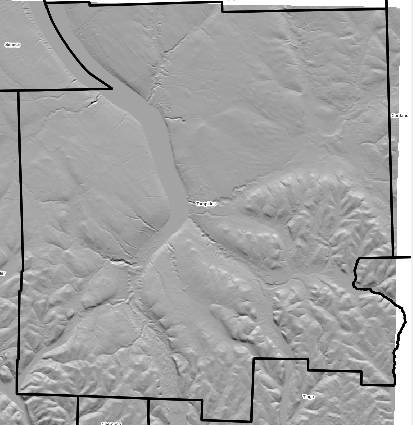 

All digital technology for visualization (monitors, printers, plotters, digital cameras, etc.) Mix up a maximum of three individual color channels together: red, green, and blue (RGB) for monitors and cameras; or cyan, magenta, yellow, keyline/black (CMYK) for printers. Each of the bands has a maximum of 256 intensity levels to create a combined color image. In other words, the combination of bands can provide different visualizations.

*Q: How do satellite images work?*
- A: Sensors receive information about an object through electromagnetic energy. This information can be coded in the frequency, intensity or polarization of the wave and is transmitted directly from the object or indirectly by reflection, dispersion or re-emission to the sensor. All materials on Earth reflect or emit electromagnetic energy. The sensors measure the intensity of the electromagnetic radiation emitted by an object and study its physical properties and variation in frequency from other objects. In this exercise, you will practice remote sensing techniques and methods to improve the contrast of images, a process called image enhancement. 

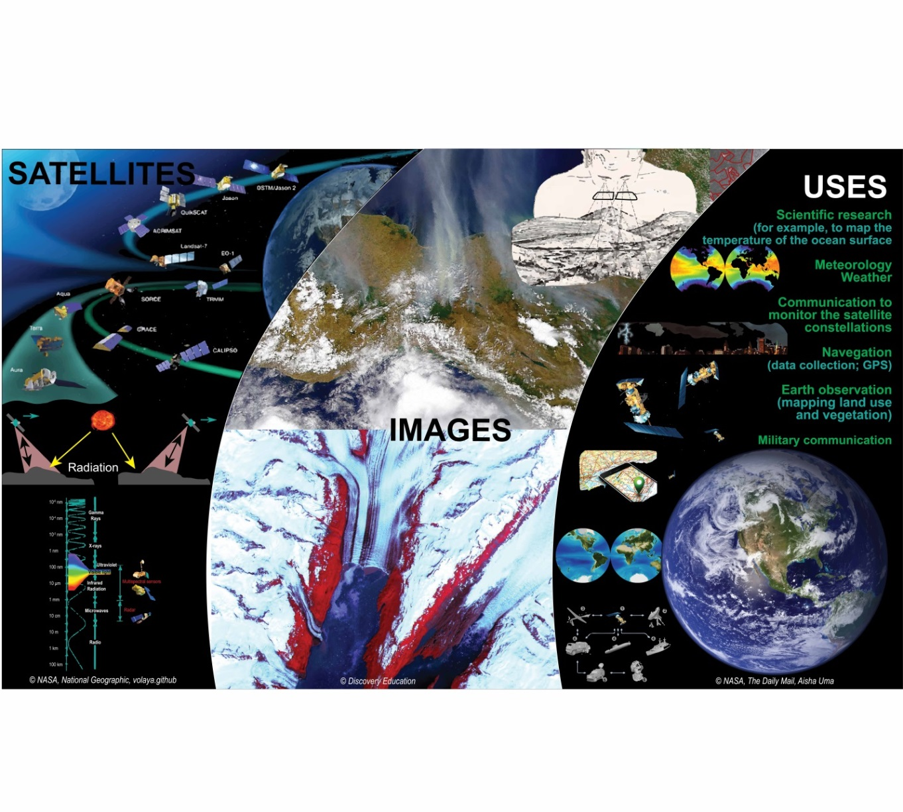

*Q: What is image resolution?*
- A: The image to the left compares the same place with two images that have different resolutions. The image on the right has a higher resolution (30 centimeter) than the image on the left (1 meter). It is easier to interpret land uses when you have a high-resolution image. Many images with free access have a resolution of 30 meters, low resolution. Note that if two images—with the same extent—where compared, the image with higher resolution would contain more data.

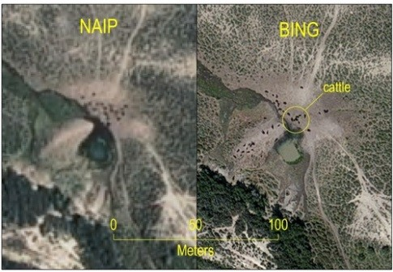
Source: [Bing Imagery](http://www.timassal.com/?tag=naip-imagery)

### Exercise 3. Raster Data Models.
Let us compare these vector models to raster data. As mentioned previously, raster data is stored in a series of columns and rows that create a grid of cells; each cell with a unique value that represents some spatial phenomenon. Raster images are important data sources and serve for many types of analyses in the areas of environmental science, natural resource management, and land development. They provide us with both current and historical information. Since the inherent structure of images is the same as raster models in GIS, the integration of these two technologies is quite common. Look at these two articles that show how satellite images can be used to map natural disasters: See Inside [Typhoon Mangkhut in 3-D](https://www.nytimes.com/interactive/2018/09/15/world/asia/super-typhoon-mangkhut-ompong-storm.html?emc=edit_nn_20180917&nl=morning-briefing&nlid=6798104020180917&te=1). Common datasets that appear in raster format are land use/land cover, digital elevation models, and satellite imagery. We will focus on land use/land cover data, digital elevation models, and orthoimagery for these exercises.

Step | Example
--- | ---
Open Raster options located in Settings>Options…>Rendering>Rasters and change the algorithm for single-band gray and multi-band color to “Stretch to MinMax”. This will give you a better contrast on the raster images. | 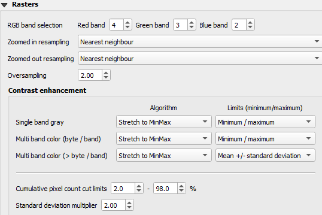
One way to add raster data is using the browser panel. To add the land use, land cover layer for Tompkins County, find the layer in your browser panel; drag and drop it into the map canvas. The image file has its unique pixelated symbol. | BROWSER PANEL
Another way to add raster data is to use the Add Raster Layer tool. Follow these steps to add the layer:
1. Click on the Add Raster Layer tool in the Manage Layers Toolbar.
1. Select the “…” icon and navigate to the folder with the digital elevation model files.
1. Select the two digital elevation DEM files (u26elu and u27elu).
1. Click Open.
1. Click Add. 
| 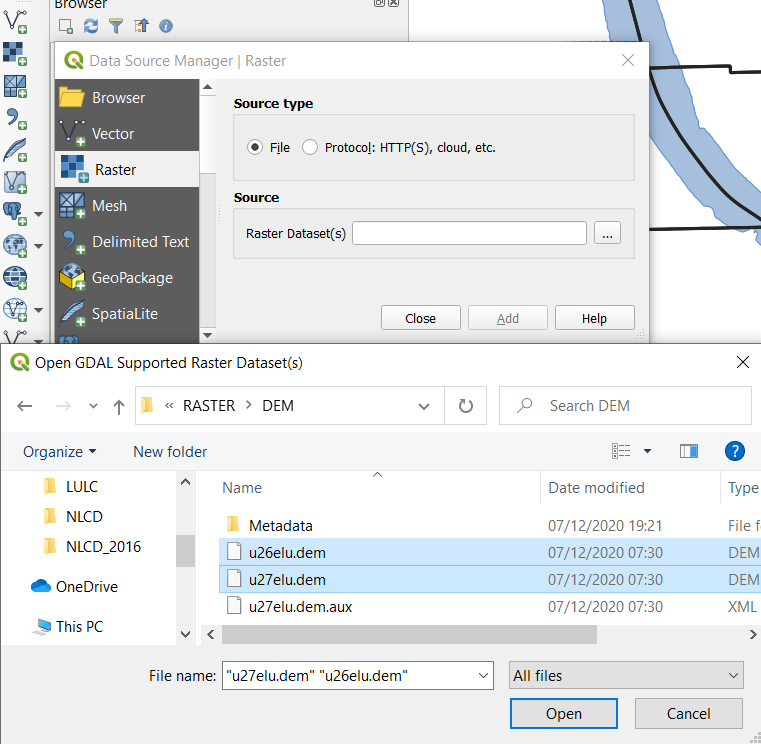
*This layer was previously edited to create a virtual raster layer that includes several individual orthoimage files. You will learn more about creating virtual layers later in the workshop.* A third way to add raster data is to find the layer in your computer files and drag and drop it into the map canvas. | ORTHO DRAG AND DROP
There is a second option for downloading a basemap of orthoimagery for the entire state, called a Web Map Service (WMS), located [here](https://gis.ny.gov/gateway/mg/webserv/webserv.html). Note that this requires an internet connection.
 
Follow these steps to include a WMS into your project:
1. Copy the WMS link on the gis.ny.gov website.
1. Open the WMS manager  
1. Give the WMS a unique name and paste the URL. Click “OK”.
1. Select the unique name from your list of WMS and click “Connect”.
1. Highlight “O” to get all NYS. Click “Add”. | 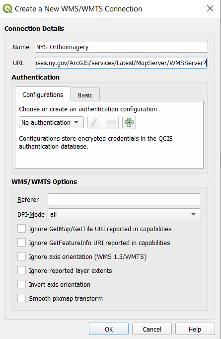 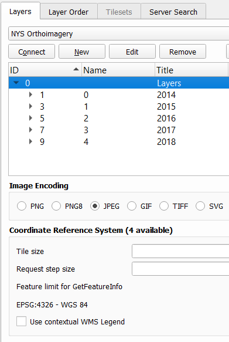

