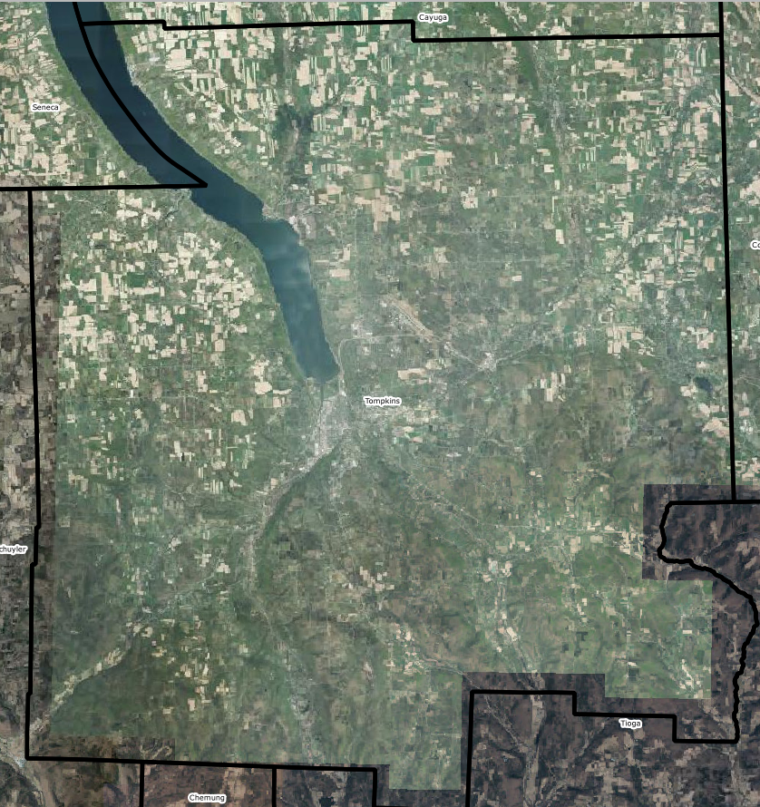

# Conferencia Virtual de QGIS en America del Norte: Taller Intro
http://qgis.us/qgis-na-2020  

La Conferencia Virtual de QGIS en America del Norte es un evento en línea que está programado para las siguientes fechas, todos los días viernes: 17 de julio, 24 de julio, y 31 de julio. Cada día comienza con un taller de 2 a 4 horas, dichos talleres se llevaran a cabo en la plataforma Zoom, y la otra mitad del día habrá presentaciones hechas via streaming de YouTube. Las sesiones se presentarán en ingles, pero el primer día habrá un taller en español. Los siguientes talleres que se ofrecen son los siguientes:  
17 de julio: Introducción de QGIS (opciones en íngles y español) 
24 de julio: Visualización 2D de geología con QGIS 
31 de julio: Recolección de datos con "Input" y QGIS  

El registro es gratuito, pero es un requisito para recibir la liga de Zoom.  

* * *
## Workshop Details
NEW YORK, United States | MEXICO CITY, Mexico | SANTIAGO DE CHILE, Chile | MADRID, Spain
--- | --- | --- | --- 
10:00a Fri, Jul 17 2020 to 2:00p Fri, Jul 17 2020 | 9:00a Fri, Jul 17 2020 to 1:00p Fri, Jul 17 2020 | 10:00a Fri, Jul 17 2020 to 2:00p Fri, Jul 17 2020 | 4:00p Fri, Jul 17 2020 to 8:00p Fri, Jul 17 2020

Este taller cubrirá los conceptos básicos de los sistemas de información geográfica, los cuales incluyen los cinco componentes principales: el hardware, el software, los datos, los procesos y metodologias, y las personas involucradas. Habrá una presentación de un resumen del hardware y los software más comunes. La sesión utilizará datos públicos como fuentes de información y explicará los procesos comunes para la recolección de datos, incluyendo recolección móvil de datos y hojas de trabajo de campo. Habrá modulos para poner los conceptos en practica y crecer sus capacidades en los siguientes temas: 

- Visualización de datos 
- Propiedades de la capa 
- Herramientas básicas 
- Tablas de atributos 
- Selecciones espaciales y no espaciales 
- Herramientas de geoprocesos y la caja de herramientas de procesamiento 
- Plugins 
- Diseño geográfico y vista de impresión

La sesión terminará con un diálogo sobre la movilización de sus redes individuales e institucionales para crecer un programa eficiente y productivo de sistemas de información geográfica, utilizando ejemplos de Mexico, Ucrania, y Nueva York.

## Objectives
- Review the QGIS software and methods for adding spatial data.
-	Evaluate various image enhancement techniques for both vector and raster data. 
-	Edit existing vector datasets.
-	Review the components of metadata and databases.
-	Use basic tools and panels in QGIS.
-	Manipulate an attribute table in QGIS, including table joins.
-	Phrase an expression to select attribute features.
-	Select features based on their relative relationship to other features (e.g. location).
-	Use common geoprocessing tools.
-	Download new plugins. 
-	Learn basic principles of cartographic design.
-	Use the print layout in QGIS to create a final map product.

## Data
Download data [here](https://drive.google.com/drive/folders/17AXbAxIPZgEM1wNTVL_Mxe051HGYUzSi?usp=sharing).
Layer | Location | Year | Source
--- | --- | --- | ---
**Civil Boundaries**| New York State | 2019 | NYS Office of Information Technology Services GIS Program Office (GPO)
**Roadway Inventory System**| Tompkins County | 2018 | New York State Department of Transportation (DOT)
**Waterbody Inventory**| New York State | 2017 | NYS Department of Environmental Conservation, Division of Water, Bureau of Water Assessment and Management
**Land Use Land Cover**| Tompkins County | 2012 | [Tompkins County Planning Department](https://cugir.library.cornell.edu/catalog/cugir-008162)
**Digital Elevation Model**| Ithaca, Tompkins County | 1995 | [U.S. Geological Survey](https://cugir.library.cornell.edu/catalog/cugir-008186)
**Orthoimagery**| Ithaca, Tompkins County | 2018 | NYS Digital Ortho-imagery Program (NYSDOP), NYS Office of Information Technology Services, GIS Program Office

## Workshop Preparation
- Favor de rellenar este cuestionario antes del fin del día miercoles, 15 de julio: [Questionario para participantes del taller introductorio de QGIS](https://forms.gle/gc8jzvZejLUwRvZJ9);
- Leer las reglas de la reunión en la siguiente sección;
- Familiarizarse con [los términos de sistemas de información geográfica](https://gisgeography.com/gis-dictionary-definition-glossary/#B)--se puede traducir la página con Google Translate en Google Chrome
- Descargar [QGIS 3.10](https://qgis.org/en/site/forusers/download.html); y
- Descargar [los datos del taller en Google Drive](https://drive.google.com/drive/folders/17AXbAxIPZgEM1wNTVL_Mxe051HGYUzSi?usp=sharing).

## Workshop Expectations
1. Al comienzo de la reunión, asegúrese de que su micrófono esté silenciado. El único momento para activar el micrófono en la reunión principal es si usted ha levantado la mano y uno de las instructores ha dicho que lo activará para hablar. En los cuartos de asesoría simultánea, puede activar el sonido de sus micrófonos y hablar con sus compañeros de equipo, pero trate de mantenerse concentrado y enfocado en la tarea.
1. Puede tener su video activado o desactivado.
1. No interrumpa durante la presentación o las demostraciones de QGIS. Si tiene una pregunta, use el icono de levantar la mano en el chat o haga su pregunta directamente en el chat. Alguien estará monitoreando el chat para responder preguntas a medida que surjan. Las preguntas y comentarios también se pueden compartir en el cuarto de asesoría simultánea.
1. La instructora preguntará si los participantes están listos para pasar al siguiente tema o actividad. Los participantes harán clic en el icono "sí" o "no" en el chat de Zoom para informar al instructor si están listos o no. Si la mayoría de los participantes están listos, entonces el taller continuará. Si la mayoría de los participantes no están listos, la instructora revisará el chat para ver qué debería revisar antes de seguir adelante.
1. Solo las instructores pueden compartir su pantalla en la reunión principal. Es posible que usted pueda compartir su pantalla en el cuarto de asesoría simultánea cuando sea apropiado.

## Introduction: Coordinate reference systems
Prior to opening any geographic information system (GIS), one should be familiar with coordinate reference systems as you will encounter several different systems in your career as a GIS user. Fundamentally, coordinate reference systems, or spatial reference systems, use coordinates to locate geographical entities, which are mapped using a unique map projection. Map projections differ by type (i.e. pseudocylindrical/cylindrical, pseudoconical/conic, and azimuthal, among others) and whether or not the projection distorts areas or shapes (i.e. equidistant, conformal, and equal-area, among others). All beginner QGIS users should know that EPSG codes are used to identify the coordinate reference system. EPSG stands for the European Petroleum Survey Group – who created the registry of coordinate reference systems codes, which are described at [epsg.io Coordinate Systems Worldwide](https://epsg.io/). 

Different organizations, institutions, and individuals may identify a standard coordinate reference system for homogeneity throughout mapping initiatives and projects. For this training, we will be using the World Geodetic System WGS84 ellipsoid and the Universal Transverse Mercator (UTM) coordinate system. Most of New York State is in the 18th zone of the northern hemisphere, which would be EPSG: 32618.

Source: [Chrismurf at English Wikipedia](https://commons.wikimedia.org/wiki/File:Utm-zones-USA.svg)

Coordinates show us precisely where we are in the world. Coordinates are created based on a known origin. A geographic coordinate system typically uses latitude and longitude that breaks the world up into axes. You can imagine (0, 0) being the core of the earth, and the latitude and longitude are the angles from the Equator and the/a prime meridian; hence, geographic coordinates are in degrees (°), minutes ('), and seconds ("), DMS, where 60 seconds equals a minute and 60 minutes equals a degree. In Figure 1, 45° north and 45° west lies somewhere in the North Atlantic if the origin is 0° latitude (the Equator) and 0° longitude (Greenwich, England). DMS of meridians (longitude) are shortened as you move closer to the poles, whereas they are “widest” at the Equator. Parallels (latitude), on the other hand, are relatively closer to being equidistant from the Equator to the poles; however, we have to consider that our Earth is not a perfect sphere, rather an oblate spheroid (or ellipsoid) due to Earth’s rotation about its shorter X axis.

Source: [Geographic Coordinate System](http://help.autodesk.com/view/ACD/2016/ENU/?guid=GUID-14B82899-9C2D-4A34-8A02-49319C6FB38C)

There is a second type of coordinate system called the projected coordinate system, which attempts to correct for this change in angles by projecting the coordinates from a specific geographic coordinate system onto a 2-dimensional plane that uses linear units. Therefore, projected coordinates are in meters- or feet-distance from the point of origin of the plane. For instance, in the Universal Transverse Mercator projected coordinate system each zone has an origin, central meridian, and false origin. False origins for northern zones lie on the Equator and 500,000 meters west of the central meridian.

Source: [Projected coordinate system, modified by author](http://help.autodesk.com/view/ACD/2016/ENU/?guid=GUID-14B82899-9C2D-4A34-8A02-49319C6FB38C)*

# Introduction to QGIS
QGIS is a free and open source software used to visualize, create, edit, analyze, and publish geospatial data that runs on Windows, Mac, Linux, and BSD. It helps us answer geographic questions and to create persuasive maps.

- Official QGIS site: http://qgis.org/
- QGIS Map Showcase: https://www.flickr.com/groups/qgis/pool/

First, let us review some things that are included with a QGIS download: 

Application | Description
--- | ---
GRASS GIS (Geographic Resources Analysis Support System) | is free; it is used for geospatial data management and analysis, image processing, production of maps and graphics, spatial modeling, and other visualizations. It can be used as a stand-alone program or directly in QGIS  by opening “QGIS Desktop 3.10.x with GRASS 7.8.x”
QGIS (previously, Quantum Geographic Information System) | is free; it is used to create, edit, visualize, analyze, and publish geospatial information. Desktop – Start new projects, edit data, perform geospatial analyses. Again, you can open Desktop with GRASS for more analysis options.
Qt Designer | to create QGIS plugins’ interface dialogs, but also to create highly customized feature forms for editing vector layers’ attributes in QGIS projects.
SAGA GIS 2.3.x (System for Automated Geoscientific Analyses) | is a GIS software with immense capabilities for geodata processing and analysis. SAGA is programmed in the object oriented C++ language and supports the implementation of new functions with a very effective Application Programming Interface (API).
Setup | a windows installer for Open Source GIS project that tracks different open source software and notifies you of newer versions so you can simply upgrade programs.

### Exercise 1. Getting started with QGIS
Step | Example
--- | ---
Start QGIS: Open the Start menu and Type or search for "QGIS 3.10" (QGIS 3.10.7-A Coruña). | 
Main bar with drop-down menus | Where you can open files, save the project, access vector processing tools, raster processing tools, settings, configuration and many other things!
Layers panel | This panel is where all the geospatial data that you have added to the project appears. You can activate or deactivate layers by clicking the square to the left of the layer. An X will appear or disappear.
Browser panel | This panel allows for navigating to the folders where your data is stored.
Map space/canvas | This is where your data is visualized.
Main tools/functions | These are the tools that you have activated for ease-of-access. By right clicking in any of the grey space you can activate or deactivate functions and tools, which add or removes them from this grey space.

In QGIS, set the project coordinate reference system to WGS 84 / UTM Zone 18N, which has the code 32618. This interface can be found on the bottom bar under the map space. It will say EPSG, which represents its spatial reference system identifier.

Start a new empty project by clicking on the blank map space/New Empty Project widget. Save the project, immediately, so as to avoid losing any progress on your mapping project. You can adjust the QGIS interface to match your preferences. You can hide or show bars/panels and arrange them anywhere. Right click on the gray part to open the list of toolbars and panels. You can check and uncheck different panels or toolbars to see what they look like in the interface. Note that your panels and toolbars options may differ from those shown in this manual. Before moving on, make sure that the “Browser Panel” and “Layers Panel” are checked and active.

*What is spatial data*
Spatial data, also known as geospatial data, is information about a physical object that can be represented by numerical values in a coordinate system.

*What is research data management or a data management plan?*
Research data management (RDM) or data management plans (DMPs) are processes that describe how data will be collected, described, documented, shared, and preserved as part of a project.

*File-naming conventions*
- Letters, numbers and underscores are best
	Date_Location_ProjCode
		2020_Ithaca_Env01
	Location_Project_Date
		Ithaca_Env01_2020
	ProjectCode_Date:
		Env01_2020

*Spreadsheets*
- The best spreadsheet is simplified so that only necessary attributes and values are shown (this way, it is easier to use in a software analysis).
- Whether it is a new spreadsheet or new spatial data with an attribute table, which is basically a spreadsheet, you need to create metadata or a data dictionary for reference.

*Organizing attributes*
- A row is a unique data record, and a column is a category or attribute for all records. Attribute headers tend to be descriptive of the data attribute. For instance, an “Area” header will tell you that the number values represent area. Note that in order to know what unit that data attribute is in, you would need metadata; a data dictionary would be helpful, as well.

*Data dictionary*
- A data dictionary should provide context in which anyone could interpret the variables in your dataset. This may be the easiest supporting document to create, considering that all you really need is Microsoft Word or Notepad. In this separate file, you name the variables and their meaning, format, precision, units, null values, and any other pertinent information needed for interpreting the data.

*Quality assurance and project management*
- There is no one way to do this; it depends on the organization's standards. It is in every step of a project or process. Consider how you will add a quality component to project initiation, planning and organizing, execution and control, and monitoring and evaluation.

*Databases and queries*
- Databases can be used as a way to organize, store, manage, and retrieve information. A database is searchable through a query, meaning that a specific term or number can be searched to find specific information quickly within the database. Many databases use Structured Query Language (SQL) standard query format, which is a standard language for relational database management systems.

# Data Visualization: Vector and Raster Data Models
**Vector data** is often created using a global positioning system (GPS), by interpreting imagery, or running analysis on existing vector data. The data can be represented as a point, line or a polygon. 

- A point represents a fixed coordinate such as an individual building, an individual tree location, or a centroid of an individual place.
- A line is a series of points that are connected, but open at two ends. It could represent a road, river, hiking/biking path, division between one region and another, etc.
- A polygon is also a series of points that are connected but are closed to create a shape. It could be an administrative unit, like an oblast, or parcel data, or an aggregated area or region.

Vector data is often stored as a shapefile (.SHP). However, as you can see in the following list, there are many other file types that QGIS can visualize, such as the KML (keyhole markup language) which is commonly used in Google Earth/Pro. Other accepted formats include:

- Atlas BNA
- AutoCAD DXF
- Comma Separated Value (CSV)
- ESRI Shapefile
- GPS eXchange Format (GPX)
- GeoJSON
- GeoPackage
- GeoRSS
- Geoconcept
- Geography Markup Language (GML)
- INTERLIS 2
- Keyhole Markup Language (KML)
- MS Office Open XML spreadsheet
- Mapinfo MIF
- Mapinfo TAB
- Microstation DGN
- Open Document Spreadsheet
- S-57 Base file
- SQLite
- SpatialLite

**Raster data** appears as an image composed of cells. The data is stored as cells in rows and columns with a unique value representing a geographic phenomenon. The larger the cells the lower the resolution of the raster image.

The most common raster data format is GeoTIFF. However, there are other formats that accepted in QGIS:

- GeoTIFF
- GeoPackage
- ARC Digitized Raster Graphics
- CTable2 Datum Grid Shift
- ELAS
- ENVI .hdr Labelled
- ERMapper .oerf Labelled
- ESRI .hrd Labelled
- Erdas .LAN/.GIS
- Erdas Imagine Images (.img)
- Geospatial PDF
- Golden Software 7 Binary Grid (.grd)
- Golden Software Binary Grid (.grd)
- HDF4 Dataset
- IBM DB2 Spatial Database
- ILWIS Raster Map
- ISCE raster
- Idrisi Raster A.1
- Image Data and Analysis
- Intergraph Raster
- KOLOR Raw
- Leveller heightfield
- MBTiles
- MS Windows Device Independent Bitmap
- Meta Raster Format
- And many more!

## Vector data models
In this next exercise, we will look at the points, lines, and polygons of the New York State region.

### Exercise 2. Vector data models.
**Village**. We will add vector data to the interface to see what land use data looks like as a point shapefile. Locate “NYS_Villages.shp” in your data folder in the browser panel. Drag it into the map space to add to the layers panel.

**Roads**. We will add vector data to the interface to see what land use data looks like as lines. View the manage layers toolbar (seen to the right) and click on the “Add Vector Layer” tool or “ctrl + shift + v”. Locate “NYS_Roadways_2018.shp” in your data folder. 

**Lakes**. We will add vector data to the interface to see what land use data looks like as polygons. Locate “NYS_Lakes_2017.shp” in your data folder. Drag it into the map space to add to the layers panel.

**Counties, Towns/Cities, NYS Shoreline**. We will add three other vector data to the interface to see what land use data looks like as polygons. Using your preferred method, add “NYS_Counties.shp”, “NYS_Cities_Towns.shp”, and “NYS_Shoreline.shp” to the layers panel.

In the layers panel, locate the new datasets. You can group the datasets into a toggleable category using the "Add Group" tool. Once you create the group, highlight the layers you want to include in the group and drag and drop them into the group.

Create a new group for land use and land cover. In that group, add the land use, land cover shapefile for Tompkins County (do not add the raster file, yet).

You can toggle the layers on and off to see the difference in geometry (i.e. points, lines, and polygons). The layers are organized like a stack of paper. What is on top is visual priority and “covers” the layers below. So, it is usually best to place point data on top, followed by line data, and lastly polygon data. Drag and drop to move layers up and down.

## Raster data models
Let’s compare these vector models to raster data. As mentioned previously, raster data is stored in a series of columns and rows that create a grid of cells; each cell with a unique value that represents some spatial phenomenon. Raster images are important data sources and serve for many types of analyses in the areas of environmental science, natural resource management, and land development. They provide us with both current and historical information. Since the inherent structure of images is the same as raster models in GIS, the integration of these two technologies is quite common. Look at these two articles that show how satellite images can be used to map natural disasters: See Inside Typhoon Mangkhut in 3-D and Indonesia Earthquake and Tsunami: Before and After Photos of the Destruction. Common datasets that appear in raster format are land use/land cover, digital elevation models, and satellite imagery. We will focus on land use/land cover data, digital elevation models, and orthoimagery for these exercises.

Access to high-resolution imagery is provided by the NYSDOP’s orthoimagery (the program's goal is to obtain imagery for the entire State on a [4 to 5 year cycle](http://gis.ny.gov/gateway/orthoprogram/lotyrs.html)) or orthomosaics provided by drone coverage. This digital Orthoimagery can serve a variety of purposes, from general planning to field reference for spatial analysis to a tool for revision of vector maps. It can also serve as a reference layer (i.e., basemap) for GIS. It is also important to think critically about the date of a satellite image. The interpretation of a January image can differ greatly from a July image considering that January is wintertime and most vegetation and agriculture are in a state of rest in New York State. For example, images from the summer months can show net primary production, crop yields, and vegetation growth better than images from winter months.

The Digital Natural Color aerial imagery was acquired in May 2018 using a Microsoft Ultracam Eagle sensor flown at a nominal height of approximately 15,550 feet Above Mean Terrain. The Ground Control used to support the 4-band ortho-imagery production was collected by identifying and surveying photo identifiable points (PID), using existing PIDs, and existing aerial targets. The Digital Aerial Triangulation (DAT) was performed. Digital Surface Models (DSM) used for ortho imagery production were generated and updated as needed using UltraMap mapping software.

 

All digital technology for visualization (monitors, printers, plotters, digital cameras, etc.) Mix up a maximum of three individual color channels together: red, green, and blue (RGB) for monitors and cameras; or cyan, magenta, yellow, keyline/black (CMYK) for printers. Each of the bands has a maximum of 256 intensity levels to create a combined color image. In other words, the combination of bands can provide different visualizations.

*Q: How do satellite images work?*
A: Sensors receive information about an object through electromagnetic energy. This information can be coded in the frequency, intensity or polarization of the wave and is transmitted directly from the object or indirectly by reflection, dispersion or re-emission to the sensor. All materials on Earth reflect or emit electromagnetic energy. The sensors measure the intensity of the electromagnetic radiation emitted by an object and study its physical properties and variation in frequency from other objects. In this exercise, you will practice remote sensing techniques and methods to improve the contrast of images, a process called image enhancement. 

*Q: What is image resolution?*
A: The image to the left compares the same place with two images that have different resolutions. The image on the right has a higher resolution (30 centimeter) than the image on the left (1 meter). It is easier to interpret land uses when you have a high-resolution image. Many images with free access have a resolution of 30 meters, low resolution. Note that if two images—with the same extent—where compared, the image with higher resolution would contain more data.

Source: [Bing Imagery](http://www.timassal.com/?tag=naip-imagery)

### Exercise 3. Raster Data Models.
Let us compare these vector models to raster data. As mentioned previously, raster data is stored in a series of columns and rows that create a grid of cells; each cell with a unique value that represents some spatial phenomenon. Raster images are important data sources and serve for many types of analyses in the areas of environmental science, natural resource management, and land development. They provide us with both current and historical information. Since the inherent structure of images is the same as raster models in GIS, the integration of these two technologies is quite common. Look at these two articles that show how satellite images can be used to map natural disasters: See Inside [Typhoon Mangkhut in 3-D](https://www.nytimes.com/interactive/2018/09/15/world/asia/super-typhoon-mangkhut-ompong-storm.html?emc=edit_nn_20180917&nl=morning-briefing&nlid=6798104020180917&te=1). Common datasets that appear in raster format are land use/land cover, digital elevation models, and satellite imagery. We will focus on land use/land cover data, digital elevation models, and orthoimagery for these exercises.

Open Raster options located in Settings>Options…>Rendering>Rasters and change the algorithm for single-band gray and multi-band color to “Stretch to MinMax”. This will give you a better contrast on the raster images.

One way to add raster data is using the browser panel. To add the land use, land cover layer for Tompkins County, find the layer in your browser panel; drag and drop it into the map canvas. The image file has its unique pixelated symbol. Another way to add raster data is to use the Add Raster Layer tool. Follow these steps to add the layer:
1. Click on the Add Raster Layer tool in the Manage Layers Toolbar.
1. Select the “…” icon and navigate to the folder with the digital elevation model files.
1. Select the two digital elevation DEM files (u26elu and u27elu).
1. Click Open.
1. Click Add. 

*This layer was previously edited to create a virtual raster layer that includes several individual orthoimage files. You will learn more about creating virtual layers later in the workshop.* A third way to add raster data is to find the layer in your computer files and drag and drop it into the map canvas. There is a second option for downloading a basemap of orthoimagery for the entire state, called a Web Map Service (WMS), located [here](https://gis.ny.gov/gateway/mg/webserv/webserv.html). Note that this requires an internet connection. Follow these steps to include a WMS into your project:
1. Copy the WMS link on the gis.ny.gov website.
1. Open the WMS manager  
1. Give the WMS a unique name and paste the URL. Click “OK”.
1. Select the unique name from your list of WMS and click “Connect”.
1. Highlight “O” to get all NYS. Click “Add”.

# Layer Properties
Every layer will have properties. Properties describe the layer and can be configured to fit your unique project needs. 

The layer properties for vector data includes:
1. Information
1. Source
1. Symbology
1. Labels
1. Diagrams
1. 3D view
1. Fields
1. Attributes form
1. Joins
1. Auxiliary storage
1. Actions
1. Display
1. Rendering
1. Variables
1. Metadata
1. Dependencies
1. Legend
1. QGIS server
1. Digitizing 	

While the layer properties for raster data includes:
1. Information
1. Source
1. Symbology
1. Transparency
1. Histogram
1. Rendering
1. Pyramids
1. Metadata
1. Legend
1. QGIS server

The layer properties that are frequently used are: information, source, symbology, labels (for vector data), transparency (for raster data), and metadata. **Information properties** is read-only and allows the user to review summarized information and metadata about the layer, including storage location, geometry type, and coordinate reference system—to name a few. **Source properties** has the layer name, encoding information, and the coordinate reference system. If the coordinate reference system that is selected is incorrect or if none was applied, then you can use the drop-down list to select a recent coordinate reference system or slick the “Select CRS” button to select a specific coordinate reference system that is not showing in the drop-down list. If you need to reproject a layer, do not do so in source properties. There are specific algorithms for doing so in the processing toolbox, which will be discussed later, or you can right-click on the layer “Export” and “Save Feature As…” a new layer with the new coordinate reference system.

**Symbology properties** allows you to change the aesthetics of your layer. When you add a layer to your project, a color scheme is usually automatically applied. For vector data you can switch from a single symbol to a categorized, graduated, rule-based, and a few other options based on the type of data you are mapping. These new styles can be saved. Raster data symbology properties include multiband color, paletted values, singleband gray or pseudocolor, and hillshade, Again, the proper symbology will depend on what you intend to visualize.

**Label properties** are only available for vector geometries and are useful for wayfinding in a map. **Transparency properties**, on the other hand, are only available for raster data and allow the user to use a slider to change how visible underlying layers are through the raster layer. The previous page described what metadata is, and the **metadata properties** is where you can create and edit the layer’s metadata.

## Metadata
*What are metadata?*
Metadata is “data about the data,” or information that describes the content, quality, condition, origin, and other data characteristics so that it can be understood, reused, and integrated into other datasets. Metadata are ESSENTIAL for any use or reuse of data; no one can responsibly reuse or interpret data without metadata that explains how the dataset was created, why, where it is geographically located, and details about its structure. In general, they answer the following questions:

- What does it represent? What data model (raster, vector) does it use?
- How was the data created? Including what software or technology was used.
- When was the data created?
- Where was it collected?
- Why was it collected?
- Who created it?

Important information that you should include for more responsible reuse and interpretation of the data are: the availability and distribution of the information, its original projection and datum, the scale, the resolution, the properties, the attributes, etc.

Metadata are used for enabling data discovery, understanding data, analysis, maintaining longevity of a dataset, and tracking the progress of a research project. It is easier today to get spatial information than ever before and authors of GIS data can share useful information to the user who will reuse or interpret the original data. Users can use the metadata to locate other data sources, read a description of how the data should be interpreted, and responsibly share the data with others.

In the US, federal agencies are mandated by an executive order to use metadata standards endorsed by the [Federal Geographic Data Committee (FGDC)](https://www.fgdc.gov/metadata/), which are 1) the Content Standard for Digital Geospatial Metadata or its extensions for biological and shoreline data and 2) International Organization for Standardization (ISO) series of standards (19115, 19115-2, 19139, etc.). There is an ongoing effort to move towards adopting the ISO metadata standard. In each of these standards, metadata must be formatted in extensible markup language (XML). For styling, a stylesheet can be applied over the XML to make it more legible to the average user. In Europe, the [Dublin Core Metadata Initiative  (DCMI)](https://www.dublincore.org/specifications/dublin-core/dcmi-terms/) metadata standards are commonly used. The DCMI developed standards has identified fifteen (15) properties that must be included in final metadata:

1. **Contributor**: An entity responsible for making contributions to the resource. Examples of a Contributor include a person, an organization, or a service. 
1. **Coverage**: The spatial or temporal topic of the resource, the spatial applicability of the resource, or the jurisdiction under which the resource is relevant. Spatial topic and spatial applicability may be a named place, or a location specified by its geographic coordinates. Temporal topic may be a named period, date, or date range. A jurisdiction may be a named administrative entity or a geographic place to which the resource applies. Where appropriate, named places or time periods can be used in preference to numeric identifiers such as sets of coordinates or date ranges.
1. **Creator**: An entity primarily responsible for making the resource. Examples of a Creator include a person, an organization, or a service. 
1. **Date**: A point or period of time associated with an event in the lifecycle of the resource.
1. **Description**: An account of the resource. Description may include but is not limited to an abstract, a table of contents, a graphical representation, or a free-text account of the resource.
1. **Format**: The file format, physical medium, or dimensions of the resource. Examples of dimensions include size and duration.
1. **Identifier**: An unambiguous reference to the resource within a given context. Recommended best practice is to identify the resource by means of a string conforming to a formal identification system.
1. **Language**: A language of the resource.
1. **Publisher**: An entity responsible for making the resource available. Examples of a Publisher include a person, an organization, or a service. Typically, the name of a Publisher should be used to indicate the entity.
1. **Relation**: A related resource.
1. **Rights**: Information about rights held in and over the resource. Typically, rights information includes a statement about various property rights associated with the resource, including intellectual property rights
1. **Source**: A related resource from which the described resource is derived.
1. **Subject**: The topic of the resource. Typically, the subject will be represented using keywords, key phrases, or classification codes.
1. **Title**: A name given to the resource.
1. **Type**: The nature or genre of the resource.

### Exercise 4. Symbology, labels, and transparency.
Each layer has a box with an “☑” If you do not want to see the layer, click on the box and it is hidden from view. The layer is NOT removed from the project. Simply, you have to click again to make it appear. To remove something, right-click and select “Remove”.

 **Save your project and save often! Sometimes QGIS will shut down if it is overloaded. So, do not get stuck having to start over on a project,** especially if you have been working on it for hours.

Each layer has specific properties. In this exercise you will edit the symbology/style. To access the properties of the layer, double-click on the name of the layer or right-click and navigate to Properties. Click on Symbology. You can also access this properties interface through the layers panel. Select the styling panel window or click F7 to open the styling panel.

*Changing symbology of points, lines, and polygons.*
**Villages**. Open Layer Properties (double-click on layer or right-clickProperties). For point data, you can change the marker type (symbol layer type), size of point, fill and stroke colors, stroke style and width. If you click on “Simple marker” you can make more detailed changes. You can save symbol styles using the “Save Symbol…” button. 

There is a field in the layer’s attribute table that represents 2010 population numbers. This information can be visualized as graduated symbols. Return to the Village layer’s symbology properties. At the top of the interface where it says “Single Symbol”, click the drop-down menu and select “Graduated”. Next, Value represents the attribute that you wish to display, visually. In this case, we will use POP2010, the U.S. 2010 Census total population count. You can change the style of the symbol and the color prior to classifying the ranges. Note that the legend format is NOT in percentages, rather as-is numerals.

We will be graduating the village layer’s points by size, between 1 milimeter and 3 milimeters. The classes, or ranges, can be divided depending on how the data is distributed, which you can review in the “Histogram” tab.

Returning to the classes tab, you will notice that you can select a statistical “mode” for dividing up your ranges. These modes use different statistical algorithms to break down the data into separate classes. You can try different methods. The more appropriate method will depend on your data and project goals. When you decide, you click “Classify”.

For this exercise, select only 3 classes for the Equal Count (Quantile) mode. Manually, you can change the size of each symbol so that the smallest range (i.e. class) is 1 point in size, the middle range is 2 point, and the largest value range is 3 point. You can keep the color ramp colors or select the same color for each ranges symbol by double-clicking on the symbol in the classify list to change the fill, stroke, and add any special fills.

 
**Roadways**. Open Layer Styling. For line data, you can select an automatic design style under “Favorites” or select “All Symbols” to see a wider variety of options. There is a field in the layer’s attribute table that represents the road jurisdiction as federal, state, county, local, or another jurisdiction. This information can be visualized as categorized symbols. Return to the Roadways layer’s symbology properties.

In the drop-down menu where you see “Simple Line”, select “Categorized”. The attribute, or “Value” in this case, that represents jurisdiction of roadways is “Jurisdicti”. Select that “Value” and “Classify”.

Jurisdictions in Tompkins County:
- 01 NYSDOT
- 02 County
- 03 Town
- 04 City or village
- 11 State Parks
- 21 Other State agencies
- 25 Other local agencies
- 26 Private or Restricted Access
- 74 Army

Merge the jurisdictions that relate to the state and color the symbol red. Merge (right-click and select “Merge categories”) all local jurisdictions into one local agencies symbol, color it white. Make army roadways a red dashed line and county roadways black. Any private roads can be yellow. Change the width of your lines as desired.

Sometimes there are values or non-values that you want to delete, which can be done by selecting the value/row and clicking the red minus button.

**Lakes**. Open Layer Properties (double-click or right-clickProperties). For polygon data, you can also change the design style to a predefined “Favorite” or generic symbol. Of course, you can simply change the color of the symbol.

**Counties, Cities/Town, and NYS Shoreline**. For each of the three layers, open Layer Properties (double-click or right-clickProperties) and edit the style as you see fit. Note: Make the interior of a polygon transparent by clicking its “Simple fill” and changing the fill color (drop-down) to transparent fill.

As with points and lines, polygon data can also be changed to “Categorized” or “Graduated” to create colorful ranges for attribute variables, such as choropleth maps. To learn more about appropriate color schemes, go to [COLORBREWER 2.0](http://colorbrewer2.org/#type=sequential&scheme=BuGn&n=3) for color advice.

*Changing symbology of raster data*

In a raster image file, each pixel has numbers associated with it, specifying a color for the pixel. The simplest representation of an image has each pixel specified by three 8-bit (24 bits total) color values, which range from zero to 255 and define the amount of red, green, and blue in each pixel. When combined, red, green, and blue can form black, white, 254 shades of grey, and 16,777,216 colors.

There are five standard options to change the style (i.e., “Render Type”) of a raster layer:
1. Multi-band color, typical for classifying satellite images;
1. Paletted, where a color is chosen for each unique value;
1. Singleband gray, where only grayscale is considered;
1. Singleband pseudocolor, where a scale can be chosen with different hues; and
1. Hillshade, for elevation rasters.

Activate the DEM layer and open its symbology. Switch to hillshade rendering. You will be able to see an accurate relief of the area.

Activate the orthoimagery raster and edit it multiple-band color. Open the properties for the new image and compute the histogram. The Histogram tab will give us a view of the different wavelength values between all the bands. We will be using Bands 1, 2, 3, and 4. Zoom in to pixel values and their frequencies. Use the mouse/hand to set the minimum values for the Band 1, Band 2, Band 3, and Band 4; choose a frequency min/max at about 2500 in this example.

                                      
Apply/OK the changes and see the difference in contrast in the image.

By changing the minimum value, which by default matches the black borders, you improve the contrast of the image!

Lastly, add the raster file for land use, land cover to the land use, land cover group: tompkinscounty_lulc_2012. Change render type to paletted and load the pre-defined color palette in the land use, land cover folder. You can change the colors yourself by double-clicking the color to choose a new one.

Pixel Value | Land Use, Land Cover Type
--- | ---
01 | Agriculture
02 | Barren or disturbed
03 | Commercial
04 | Inactive agriculture
05 | Industrial, Transportation, Transmission
06 | Public/Institutional
07 | Recreation
08 | Residential
09 | Vegetative cover
10 | Water
11 | Wetlands
999 | NULL

In the next tab, Transparency, you can add transparency to see images and spatial features behind the dataset.

# Basic Tools: Pan Map, Zooming, and Measurement Tool
There are many panels and toolbars on your main screen that you can view or hide from view, including the layers panel, map navigation toolbar, and attributes toolbar. It is recommended that you familiarize yourself with these icons and tools as they are commonly used in projects. The following tools are used for map navigation.

Icon | Description
--- | ---
 | Pan: Click and drag to move within the map space to find your area of interest. This can also be done with the space bar and a mouse.
 | Pan map to selection: Pans to selected features but does not zoom into the features.
 | Zoom-in: Focus on features at a larger scale, i.e., closer to 1:1 scale. A mouse wheel scrolled upwards will also zoom-in.
 | Zoom-out: Focus on features at a smaller scale, i.e., further away. A mouse wheel scrolled downwards will also zoon-out.
 | Zoom full: Zooms to the full extent of all data layers.
 | Zoom to selection (vector): When there are features selected, this tool will pan and zoom to only those selected features.
 | Zoom to layer: Zooms to highlighted layer in layer panel.
 | Zoom to native resolution (raster layer)
 | Zoom last: Returned to previous zoom extent, like a zoom undo.
 | Zoom next: Return to most recent zoom, like a zoom repeat.
 | New map view: Opens a new map screen to pan and zoom, separately from the main map space.
 | New spatial bookmark: Create a spatial bookmark for the user or the project, or a saved geographic location to return to quickly.
 | Show spatial bookmarks: The saved bookmarks will appear in your browser panel. 
 | Refresh: Map canvas and layers update, especially useful after adding a layer, panning or zooming, resizing the window, or changing visibility of a layer

It is important to understand the attributes for each of your layers. The attributes toolbar will help you familiarize yourself with the attribute information. It also includes a simple tool for calculating lines, areas, and angles: the measurement tool. Most select features tools will be covered in the section on spatial and non-spatial data queries.

Icon | Description
--- | ---
 | Identify features
 | Select features
 | Select features by expression
 | Invert feature selection
 | Deselect features from all layers
 | Open attribute table
 | Open field calculator
 | Processing toolbox
 | Show statistical summary
 | Measure line
 | Measure area
 | Measure angle

The following exercise will highlight a few of the tools listed in the previous tables.

### Exercise 5: Map navigation and attributes toolbar
*Map navigation*
1. Pan to a different part of the map.
1. Zoom to the full extent of the data. 	 
1. Select and highlight the layer for Tompkins County roadways. Then, click on the zoom to layer icon. You can also right-click and select “Zoom to Layer”.	     
1. Click on the zoom last icon to return to the zoom view of New York State.

*Measuring*

The interactive measure tool allows for measuring the horizontal distance in the map space. The calculations are made based on the coordinate system for the project. You can change the units, start a new measurement, configure the settings, close an accidental click, or ask for help to open QGIS Help function. Calculations can be made with ellipsoidal (default) or cartesian math, which is used for projected and planimetric area or distance.

With the measurement tool, you can also measure area. Just like with the measurement line tool, you can change the units from square kilometers to hectares or any other unit that you are analyzing. “New” button allows you to start a new measurement. According to the NYS Department of Health, the state of New York covers 47,214 square miles (122,284 km2), so you can see that this quick measurement was slightly higher.

# Attribute Table and Table Management
An attribute table provides additional information about specific features in a layer. The rows represent a single feature in the dataset while the columns represent an attribute of that single feature. All of this information can be filtered, selected, and edited. Review the [tools](https://docs.qgis.org/3.10/en/docs/user_manual/working_with_vector/attribute_table.html) found in the attribute table, especially

- IMAGE to indicate that the layer is in edit mode and you can modify the data, and
- IMAGE to indicate that the layer being edited has some unsaved change.

### Exercise 6. Editing attribute tables
*Adding a new area field/attribute to polygon data*
We will look at the total area in hectares of the land use and land cover datasets. We will open the attribute table to create a new field for area in hectares. To do so, right-click and select Open Attribute Table. There are nine attributes: OBJECTID, LU, STATUS, COMMENTS, General, Acres, Shape_Length, and Shape_Area. We are going to delete the field that are irrelevant to our purposes: STATUS, COMMENTS, and Shape_Length. Click OK.

None of these attributes tells us the area value in hectares. So, you will need to click the Open field calculator tool. Follow these steps to create an area field:
1. Make sure Create a new field is selected
1. Write “hectares” in Output field name
1. Select Decimal number (real) as the output field type
1. Output field length of 10 characters and 2 decimal places
1. Add the expression $area/10000
1. Click OK

Now you will notice an additional “hectares” field has been created. Since our projection is in meters, the map units are also in meters. For this reason, we divided the function $area by 10,000 since 10,000 m2 = 1 ha. Click the column title and it will be ordered lowest to highest. Click the title again, and it will order from highest to lowest.

When you are done editing the field. Click on the Save edits button and turn the Toggle editing mode off. One of the tools you can use to add up the sum of the area values is in Vector>Analysis Tools>Basic Statistics for Fields… 

Choose the input layer (tompkins county_lulc_2012) and select the field that will be calculated (hectares). You can make the output an HTML temporary file or save in your folder as a permanent file. The temporary files are stored in the temporary folder specified in QGIS configuration. Click Run. 

A Results Viewer window will appear. Click on the File path link, and the HTML will open in your browser. You can also double-click on Statistics [TIME].

In the webpage, you will find all the statistical data for that field. Look for Sum. This will tell you the total area value in hectares for Tompkins County. There are other statistical outputs, which can be useful for other numerical attributes.

*What does this look like in a raster?*
We will review the processing again toolbox later. In the attributes toolbar you will find the toolbox. Type in “area” and open Raster layer unique values report.

In the Raster layer unique values report tool, select the Tompkins County land use, land cover raster dataset. Click Run, and open the unique values report (also in HTML format).

 
You will see the value of the pixel (which represents a land use, land cover class), the number of pixels in that class, and the area in square meters. The area takes the number of pixels and multiplies it by the size of a single pixel (10 meters by 10 meters).

## Joining Tables
To link the value of the land use, land cover class (i.e., 1-11, 999) to their description in the shapefile, a table join can be used. In order to join a spreadsheet to your attribute table, there must be a common identifier. In this case, OBJECTID is the shared field between our land use, land cover codes’ spreadsheet and the land use, land cover shapefile:

### Exercise 7. Review attributes and join tables
*Review attributes and preparing the datasets*
1. Find the file that contains the table/spreadsheet that you wish to join to an existing dataset and drag it into your project. It will appear in the Layers Panel.	 
1. Open the properties of land use, land cover shapefile.
1. In the Properties interface, you will find a section (tab) called Joins. As you can see, there are no joined layers, so we must add a new one, using the green plus button. In the Add Vector Join interface, the Join layer is the table file, which in this case is a CSV file. The field that they share should be selected for Join field and Target field. Cache the information into a virtual memory checked (default). If you do not want to join all fields, you can select which fields interest you in the Joined Fields section. By default, the software adds a prefix to the data fields, so you remember that they are virtual (not permanent). To remove the prefix or add a different one, select “Custom Field Name Prefix” and edit or remove it. Click OK.

If you want to create permanent fields out of the virtual joined data attributes, you can open the Field Calculator, “Create a new field” with a different name than the joined attribute name. Change the field type, length, and precision to match that of the original data. Find and select the joined field name in Fields and Values so that it appears in the expression. Click OK. Now in the attribute table you will have a permanent field for that attribute.

# Spatial and Non-Spatial Data Queries
One of the characteristics of GIS programs is that they can select spatial features of a layer based on the attributes or geographical location. When you have identified them, these objects can be (1) seen highlighted in the map, (2) be analyzed statistically (only for those selected features), and (3) saved as a new layer for viewing or further analysis. An essential GIS skill for any individual or institution is to understand and manipulate the layers according to their attributes and/or location. To demonstrate these concepts, we will be selecting data from the land use, land cover shapefile to gather area in hectare calculations per land use, land cover type.

## Non-spatial Data Queries
We will do simple, non-spatial queries to select specific data. Non-spatial structured queries are used when you want to filter features of a layer according to its characteristics, or attributes.

Let’s take for instance Vincent van Gogh’s bowl of fruit, which has two pears, two apples, and one orange. These fruits have different attributes, such as color, size, taste, and type. A standard query language (SQL) can help us filter the fruits based on those attributes.

ID | TYPE | COLOR | SIZE | TASTE
--- | --- | --- | ---| ---
1 | Apple | Red | SMALL | Sweet
2 | Apple | Red | MED | Sweet
3 | Orange | Orange | Small | Citrus
4 | Pear | Green | LARGE | Sweet
5 | Pear | Green | LARGE | Sweet

**Simple**. If our question was, “How many fruits are red?”, then, the SQL expression would be: 
“COLOR” = ‘Red’
The selection would highlight ID 1 and 2. This is a selection based on one attribute value.

**AND**. If our question was, “How many fruits are red and small?”, then, the SQL expression would be:
“COLOR” = ‘Red’ AND “SIZE” = ‘SMALL”
The selection would highlight ID 1. With Boolean AND, all the selected features must comply with ALL the requested attributes.

**OR**. If our question was, “How many fruits are red or small?”, then, the SQL expression would be:
“COLOR” = ‘Red’ OR “SIZE” = ‘SMALL”
The selection would highlight ID 1, 2, and 3. Contrary to Boolean AND, Boolean OR will select features that have ANY of the requested attributes.

**NOT**. If our question was, “How many fruits are not red?”, then, the SQL expression would be:
NOT (“COLOR” = ‘Red’)
The selection would highlight ID 3, 4, and 5. The selection must not have the attribute value.

**LIKE**. If our question was, “How many fruits are citrus?”, then, the SQL expression would be:
	“TASTE” LIKE ‘%Ci%”
The selection would highlight ID 3, since its attribute contains part of “Ci” (case sensitive).

**ILIKE**. If our question was, “How many fruits are citrus?”, then, the SQL expression could also be:
“TASTE” ILIKE ‘%ci%”
The selection would highlight ID 3 again; since it contains the letters “ci” and it ILIKE is not case sensitive like LIKE.

### Exercise 8. Non-spatial data query.
Review the attributes of your dataset. We will select all the active agriculture fields. Find the Select by expression tool either in the main toolbar or in the attribute table. 

You can select attributes for your selection and specifically the values of that attribute. You can see all the values per attribute (field), by clicking Load values “All Unique” button. Create the expression: “General” = ‘Agriculture’ and click Select Features.

Your expression is incomplete if you have an output preview that says, “Expression is invalid”. It should appear with a black number confirming validity. The number of features selected can be found at the top of the attribute table and will be mentioned in the bottom ribbon of the main interface screen.

Open the attribute table. In the bottom right, you will see that “Show All Features” is the default. Change this to “Show Selected Features”. The table will show only the features that fit your expression.

In the map space, these features will appear selected in yellow compared to the main style color for the layer. We will calculate the statistics again for the layer using the show statistics summary tool, but only for the selected features (agriculture). Repeat these steps for the 10 other land use, land cover categories.

If you wanted to select several classes at once, for instance active and inactive agriculture, you could use the AND operator. The Boolean operators like AND explained previously are in Operators in the center section, but can be typed in the expression, as well.

## Spatial Data Queries
In a spatial data query, the objects of a layer are selected according to their proximity or relative location to the objects of another layer. They are based on 1) all the features within a layer or 2) the features selected from a previous selection. Consider again our van Gogh example. Imagine that the fruit are one layer and the bowl is a second layer. 

Case #1
We want to select all the fruit that are in the bowl. So, the layer that we want to have selected at the end is the fruit, or our source features.  Our function would be within since we ONLY want the fruit that are within the limits of the bowl. The bowl is our reference features layer. When we create a new selection, the following features are selected:
- The apple in the bowl
- The orange in the bowl
- The first pear in the bowl
- The second pear in the bowl

Case #2
Remember our simple selection, “COLOR” = ‘Red’, which selected the two apples? We can create a new selection based on that selection. Imagine that the two apples are selected as our source geometries within the source features. If we added the spatial query for those selected features within the bowl layer, then our new selection would be:
- The apple in the bowl

The different relative relationships that exist for different geometries are as follows:

The main spatial relations between features for selection mentioned in the above table are: 
- **Crosses** (only possible with line or polygon geometries, is when the source features cross the reference object), 
- **Contains** (source polygons can contain points, lines or polygons; a source line can only contain a point; features that are partially or completely within the source feature and is OK to have boundary intersection), 
- **Within** (a source point can only be within a line or polygon; a source line or polygon can only be within a polygon; objects and its boundaries that are completely within the reference feature), 
- **Is disjoint** (any feature can be disjointed with any other feature; does not touch or intersect with the reference layer at all), 
- **Equals** (only happens between features with the same geometry; a source point is exactly on the reference point and the same between line-line and polygon-polygon) 
- **Intersects** (the opposite of “is disjoint”; an intersection can happen between any feature geometries; source feature touches, within, crosses or intersects with the reference layer), 
- **Overlaps** (only happens between features with the same geometry; only where reference features cross the borders of the source feature and part of the geometry is within the other), and 
- **Touches** (point, line, and polygon source features can only be touched by reference lines or polygons; source features touch borders, but do not cross and are not within the reference feature). 

### Exercise 9. Spatial Data Query.
In this example, we will be selecting the land use, land cover classes that intersect the City of Ithaca to create a new dataset. Before we run the spatial data query, use the identify tool to try and find the City of Ithaca in the NYS_Cities_Towns layer. You can use a non-spatial data query or the Select features tool to select the City of Ithaca.

The tool to run their spatial relationships is within Vector>Research Tools>Select by Location… 

Our input feature to select is the layer from which you wish to have features selected. The “Where the features…” section allows you to decide what spatial relation is necessary for this selection. The comparison feature is the layer that you want to know exactly what its relative location is to the input feature. If you have certain features that are relevant, thus selected, you can check “Selected features only” underneath the “By comparing to the features from LAYER” section.

There are several options for the type of selection you can do. You can create a new selection, add to the features that are already selected in the input layer, select from the selected features in the input layer, or remove from the selected features in the input layer.
You will see that the new selection appears in yellow in the map space. They will also appear highlighted in the attribute table.

You can create a new layer from the selected features. Right click on the layer in the layers panel>Export>Save Selected Features As… and save it as a new file in your geospatial database.

 # Geoprocessing Tools and Processing Toolbox
*What spatial projects are you interested in designing?*
Approaches to spatial analyses will depend on a variety of factors, including your objectives, the final product you are seeking to create, and the themes you intend to cover. Once you have begun thinking about the analysis that you want to do, you can begin the project. There is no one-size-fits-all procedure for designing a project. These 10 steps below can be a good place to start organizing your thoughts. In this workshop, we have—informally—covered steps one through six. The remainder of the workshop will touch upon step seven and step 9. It is recommended that you spend more time learning about step 8 and step 10.

1. Identify the situation/issue and objectives.
1. Identify desired final product.
1. Review topics/themes and conduct necessary research.
1. Determine intended scale.
1. Identify data, its representations and formats.
1. Manage data attributes.
1. Explore and define patterns, spatial relations, workflow, and map properties.
1. Follow designated procedure for database management and delegate responsibilities.
1. Review final products and adapt them, if necessary.
1. Create metadata and document the database design for future use.

To explore and define some patterns based on spatial relations between datasets, the following workflow is generally used:
 

 
The input is the dataset that you wish to modify. The tool establishes the overlay function or algorithm that will be used to create a new data layer. The output is the new data layer that is created from the input layer. Some tools have multiple inputs. You may need to use several tools to get the output that you desire. 

The exercises in this section will highlight clipping tools and the creation of a virtual raster layer.

### Exercise 10. Selected vector and raster tools
*Clip*
A clip can be just as useful as a selection based on location. In this example, we will clip the land use, land cover classes to the City of Ithaca’s boundaries to create a new dataset. Like before, you can use a non-spatial data query or the Select features tool to select the City of Ithaca. 

- The input layer: The land use, land cover dataset for Tompkins County.
- Overlay layer: the selected City of Ithaca in the NYS Cities and Towns dataset.
- You can save the output in either a temporary or permanent location.
- Click Run.

The output will be the land use, land cover layer only for the city.

*Raster Clip by Mask*
You may want to clip a raster dataset to your research area or area of interest. To do so, follow these steps:

1. Go to Raster>Extraction>Clip Raster by Mask Layer…
1. Fill in the parameters. Select the land use, land cover raster image as the Input layer and the City of Ithaca (as a selected feature from NYS Cities and Towns layer) as the Mask layer. Check “Match the extent of the clipped raster to the extent of the mask layer.” Save the output file (Clipped mask) to a permanent or temporary file. 
1. Run the tool. Now there is a smaller, clipped raster image of land use, land cover.

 
*Creating a Virtual Raster Layer*
We are going to merge the digital elevation models (DEM) into one virtual raster layer. Locate the DEMs in the raster group. You will notice that each image represents a portion of the City of Ithaca with various gray-scale shading.

1. In the Raster menu select Miscellaneous>Build Virtual Raster… to open the virtual raster tool.
1. Select all the DEM tiles for the “Input layers”.
1. Uncheck “Place each input file into a separate band”.
1. Either save the virtual file or keep it as a temporary file.
1. Run the tool.

Now, the layers have been merged into one image, which can be edited as a single layer.

*Processing Toolbox*  
The processing toolbox has a wealth of other tools that you might find useful. If you are familiar with Esri’s toolboxes, then you may see several similarities between the two. Spend time reviewing these lists to see if there are any tools that may be useful to your workload and workflow.

# Plugins
According to the [QGIS plugins web portal](https://plugins.qgis.org/), “QGIS plugins add additional functionality to the QGIS application. There is a collection of plugins ready to be used, [available to download](https://plugins.qgis.org/plugins/). These plugins can also be installed directly from the QGIS Plugin Manager within the QGIS application.”
 
Notes for plugin users
- Plugins are developed by independent organizations and developers, the QGIS organization does not take any responsibility for them.
- Bugs or feature requests relating to plugins that are published here must be opened in their respective bug tracking systems. A plugin's bug tracking system can be found on the information page for that plugin.
- If no information is available, please report it to the [Developer mailing-list](https://lists.osgeo.org/mailman/listinfo/qgis-developer).
 
Resources for plugin authors
- The [pyQGIS cookbook](https://www.qgis.org/pyqgis-cookbook/plugins/index.html#developing-python-plugins) contains a section on developing plugins and is an ongoing effort to collect tips and tricks about QGIS python programming generally.
- The [QGIS Python API](https://www.qgis.org/pyqgis/) and the [QGIS C++ API](https://www.qgis.org/api/) are the ultimate references for plugins creators.
- Please consider adding your code as a subplugin of Processing, rather than as a separate plugin: you save coding, and the users have more consistent and powerful tools, that can be integrated in a model, run in batch, and more
- Learn how to [publish your plugins](https://plugins.qgis.org/publish)

OpenStreetMap
OpenStreetMap is the open-source, community-driven version of Google Maps. It is created through millions of contributions from mappers who update information like road names, city and town boundaries, and many more features. These mappers are called contributors, and they use satellite images, global positioning system devices, and field work to update OpenStreetMap online.

Remember that if you use an OpenStreetMap basemap, then you should give credit to the contributors of the OpenStreetMap project. To do so, include “© OpenStreetMap contributors” on your final map products. For more information, go to [OpenStreetMap](https://www.openstreetmap.org/about). 

### Exercise 11: QuickMapServices plugin
The plugin we will be downloading is for a collection of basemaps, called QuickMapServices plugin. You can see all your plugins under the Plugins menu>Manage and Install Plugins... The basemaps alternatives are: Landsat, MapSurfer.NET, NASA, OpenStreetMap, and eAtlas Mos. You can search QuickMapServices and set proper scale and settings.

 

 

You may need to save your project and restart QGIS for some plugins to activate. For QuickMapServices, find OSM (i.e., OpenStreetMap) and add the standard basemap to the project. Now, you should be able to see roads and other features commonly found in basemaps.

# Cartographic Design and Print Layout
What is a map? It is a three-dimensional representation on a plane (two-dimensional) surface that projects spatial information such as cities, elevation, streets, etc. At the end of the day, the design and creation of a map depends very much on the map product discussed in the geospatial process design process explained previously. Important questions to answer are, “Who are the target end users?”, “What is the topic?”, and “What is the scale?” Of course, the symbology and the spatial features that you would use change from one project to another.

There are several cartographic elements that need to be included in any map. Each map has three (3) main elements of cartography: **scale**, **projection**, and **symbology**. The scale shows that the size of the study area. Without this information it can be difficult to read and understand the map’s extent. Projection is another essential element as it affects relative shapes and sizes of the features. Remember that there is distortion when you put the world (a 3D ellipsoid) on a 2D surface. The features and their angles change. Therefore, it is always good to use a projection that minimizes this distortion and mention it on your final map and in your metadata. The symbology must include, at least, these elements:
- the title,
- the geospatial data (vector or raster),
- the datum and projection name,
- the legend or a written description of data,
- the scale, and
- descriptive text, including credits and labels.

Cartographers use a concept called "a graphic hierarchy," to prioritize information. That is, the most prominent and visible cartographic elements should be the most important information on your map. The title and the data (the layers) are typically the most important. Next, the reader needs reference points such as scale, labels on the map, and/or an inset map. At the end of the hierarchy is the descriptive text: the sources, the author, the general metadata. In each map you should try to take into account the following key points:
- Create a visual contrast between colors and shapes,
- Ensure that the text is legible,
- Organize all the map elements adequately in order to eliminate “white space” and show more information,
- Prioritize the layers depending on the project’s objective, and
- Create harmony between all the elements.

 
When you make a map, you have to be aware of the use of color. In the cartographic world, colors are significant and hold significance. For example, blue typically represents water; green would be vegetation; and red shows some danger or warning. There is an online website that provides color advice for cartography: ColorBrewer 2.0. Some color schemes are not appropriate for a potentially colorblind audience, printing, or photocopying. Make sure you choose wisely.
	
For the final map user to locate the area, the map should include geographical references such as city names, borders and names for each administrative unit (e.g. region, state, and city), streets, among others. Labels are a type of text on your map, as well as the title, the source of the data, the author, the datum and projection, and other map descriptions. Other secondary elements that can be added to your map:
- a north arrow,
- a frame or border around text or data,
- an inset map for added reference,
- the logos,
- the name of the institution,
- other graphs of the data, and
- whatever you can imagine.

If you are going to label the elements on the map, the most important thing is to make them legible. In the following examples, the first is the only, truly legible option:

 

The font, color, size, style (*italic* or **bold**), and position are all important. One common cartographic rule is “always include two font types per map,” one without/sans serifs (e.g. Verdana, Arial, Tahoma) and another with serifs (e.g. Times New Roman, Palatino Linotype, Cambria).

 

In this module we make a choropleth map, which is a thematic map that is symbolized so that the colors of each area represent classified values. For instance, you can show areas of something within (we will be doing this), rates of change, population per area, and other comparable factors. The different types of breaks are: 

Break Mode | Description
--- | ---
Equal Count (Quantile) | This method will decide the classes so that the number of values in each class are the same. If there are 100 values and we want 4 classes, quantile method will decide the classes such that each class will have 25 values.
Equal Interval | As the name suggests, this method will will create classes which are at the same size. If our data ranges from 0-100 and we want 10 classes, this method would create a class from 0-10, 10-20, 20-30 and so on , keeping each class the same size of 10 units.
Logarithmic scale | A logarithmic scale is a nonlinear scale used for a large range of positive multiples of some quantity. It is based on orders of magnitude, rather than a standard linear scale, so the value represented by each equidistant mark on the scale is the value at the previous mark multiplied by a constant.
Natural Breaks (Jenks) | This algorithm tries to find natural groupings of data to create classes. The resulting classes will be such that there will be maximum variance between individual classes and least variance within each class.
Pretty Breaks | This is based on the statistical package R’s pretty algorithm. It is a bit complex, but the pretty in the name means it creates class boundaries that are round numbers.
Standard Deviation | This method will calculate the mean of the data, and create classes based on standard deviation from the mean.

When there are multiple or random variables, it is common to normalize the data by transforming values into a specific, single comparable range. When the total values of a variable (e.g. populations or quantities) are mapped, it is necessary to normalize the data by area or by total population. This creates a proportion or ratio (attribute to map ÷ attribute to standardize against).

1. Percentages (i.e. percent of total) can be compared as opposed to raw quantities for areas or populations that vary dramatically:
(Attribute value for feature x)/(Sum of attribute values in all features)=Proportion (%)of total contained in feature x
1. Another percentage can represent one attribute normalized by another (what we will be mapping in this module):
(Attribute value for feature x)/(Universe value for feature x)=Proportion (%)of universethat is the attribute
1. Attributes can be normalized by their association with other attributes as a ratio:
(135 males (in x))/(165 females (in x))=.818 or 82 men for every 100 women
1. Lastly, attributes can be combined to show change over time, such as population of one year against population of another year. Since change can be both positive and negative, zero (0) is considered the transition between positive and negative values. For instance:
((Present value in x (300 in 2010)-Past value in x (250 in 1990))/(Past value in x ( 250 in 1990)))*100=2010 population is 20% more than in 1990
 
If you were to print your map, you must consider the size in which it will be printed. You have to choose a specific paper size before adding elements to your map; otherwise you might print out a pixelated map that is hard to read. Also, depending on institutional standards and/or the data shape, you might have to change the page orientation from portrait to landscape, or vice versa. You can also set margins to avoid parts of the map being cut off when printed.  

Type | Size (cm) | Size (in)
--- | --- | ---
A3 | 29.3 x 42 | 11.7 x 16.5
A4 | 21 x 29.7 | 8.3 x 11.7
A5 | 14.8 x 21 | 5.8 x 8.3
B4 | 25 x 35.3 | 9.9 x 13.9
B5 | 17.6 x 25 | 6.9 x 9.8
Executive | 17.8 x 25.4 | 7 x 10
Legal (USA) | 21.6 x 35.6 | 8.5 x 14
Letter (USA) | 21.6 x 27.9 | 8.5 x 11
Statement | 19.7 x 27.3 | 7.7 x 10.7
Tabloid | 27.9 x 43.2 | 11 x 17

### Exercise 12: Create a choropleth map and add labels
We are going to create a graduated, choropleth map of the percent of population change by county between 1990 and 2010.
1. Select “Graduated”
1. Select the expression icon to calculate population change:
1. Change the legend format so the legend will be a percent with a precision of 0 to eliminate decimal places.
1. Choose the red to blue color ramp.
1. Click “Natural Breaks (Jenks)” mode and “Classify” into 5 ranges.
1. Apply changes to the layer.

 

 

You can add labels to your map. In Layer Styling for NYS_Counties, change “No labels” to “Single labels” for the attribute with NAME values for each county. You can change the font, font size, color, etc. You can even add a buffer around the text. You can edit the label placement for every label using Placement tab or label toolbar.

Zoom out to New York State to see your data symbolized as a choropleth map.

 

## Print Composer in QGIS

 

The print composer is the space where you begin creating your final map product. It is a separate interface within the QGIS desktop application/software.

### Exercise 13. Print composer in QGIS.
To open the print composer, following route Menu Bar > Project > New Print Layout or with (Ctrl + P). A small interface will ask what name you would like to establish for the print layout. This does not automatically become the title of your map, so you can title the print composer something that lets you know what it represents.

	   
**Page setup**. In the pop-up screen you will have to right-click and find the Page Properties… The sizes were explained in the cartographic design introduction. You can change the orientation and margins, as well. Be aware of the units used to measure margins.	  

 

**Elements of the map**. The first step for adding elements to the composer is to  Add new map. Click the tool icon and draw the rectangle for your map space. It will appear when you finish drawing the rectangle.

You will need to add and move around map elements and content. To do so use the following tools:

Icon | Description
--- | ---
 | Pan composer to move around the composer (not the data)
 | Select move item (elements of the map); this is the tool to use for changing the extent or position of an element
 | Move item content; panning within the new map (hint: if you hit “ctrl” and scoll it zoom in/out).
| Zoom into/out of map; this does not zoom into or out of data)
| Refresh view allows any changes made in the QGIS main interface to appear on the Print layout
| Add shape tool
| Add image
| Add a new north arrow
| Add new label
| Add scalebar
| Add new legend
| Add
| Delete
| Rename the layer
| Export map as PDF, SVG, or image

The scale sometimes needs to be edited; in which case you would need to change the scale ratio. To make the scale smaller would require give it a larger denominator value. 1:30000000 would cover all North America. A larger scale would need a smaller denominator, like 1:30000 would “zoom in” to the City of Ithaca. Use “ctrl” and scroll bar on a mouse to zoom in or our slowly.

Add frame and grids. You can add a frame to the new map so that it has a border between map space and the white space in the margins. You can add grids to maps to show coordinate values, or simply to add aesthetics. You would have to add a new grid with the green plus button, which will create Grid 1. Then edit the different characteristics of the grid (i.e., modify grid). Note that it will match the datum and projected coordinate system that we identified at the beginning of the module (WGS 84/UTM Zone 18N). You can change the intervals to space out grid lines, as well as change the style of the lines. For instance, it is good to have fewer grid lines or lighter grid lines so that they do not compete too strongly against the data and symbology in the graphical hierarchy. 

Add coordinates. You can change the frame and include coordinates on the final grid. The coordinates are under “Draw coordinates,” which would need to be activated to edit the options.

Add Rectangles, ellipses, and triangles. Rectangles often function well as background and frames for areas that include several different map elements. Draw one rectangle with a white background and a grey/black outline using the   Add shape tool. We will fill in this space with the scale, text, north arrow, and logos. If at any point you accidentally add an element and want to delete it, you simply need to select that element in the items list, go to Edit>Delete.

Add image. There are many images that can be added to your final map. If you have an inset map to add, you would do so with the add image tool to browse for the image in your file folders. If you have a logo to add, again you can use the add image tool. 
 

 
Add north arrow. The “Adds a new north arrow…” add a north arrow to the project. If you click on “Search directories” the software will search the program files for its svg files that were downloaded with the software application. There are also icons in here for cultural features, such as camping, bathrooms, and signage.

Add new label (text). The add new text tool is essential for adding the following map elements, such as projection and datum information:
1. Credits (i.e., author, date of map, sources, basemap copyright, and coordinate reference system),
1. Notes (i.e., details about the dataset or quality of the data), and
1. Title, subtitles, and year of data.

Add a scalebar. As you already know, scale is one of the mandatory map elements. It explains the scale that you modified when you added the map to the composer. It will appear on the final map so that users can understand how large of an area is being represented. In the Main Properties for the scale bar you want to make sure that the scale is for the active, main map – in this case, Map 1. You can change the tick marks and scale style, units, and segments to make it more aesthetically pleasing. To be consistent in your use of font, open “Fonts and colors” to edit the font type and color.

 
Add new legend tool allows you to draw a legend space. You can activate Auto update to add all the map elements or just add them or delete them individually. You can also change the name of a layer. Adding a frame and background builds contrast with other map elements. Remember to be consistent with fonts in your final map.

 
Once you have completed your final map, you can save the composer. If you are ready to publish the final map, you can do so as a PDF, SVG, and image. For the image export, it will ask you what resolution you want in dots per inch (dpi). The higher the dpi the better the resolution and the larger the file. Once you click Save the file will be saved into the folder file you identified previously.

Congratulations on successfully completing the workshop!

